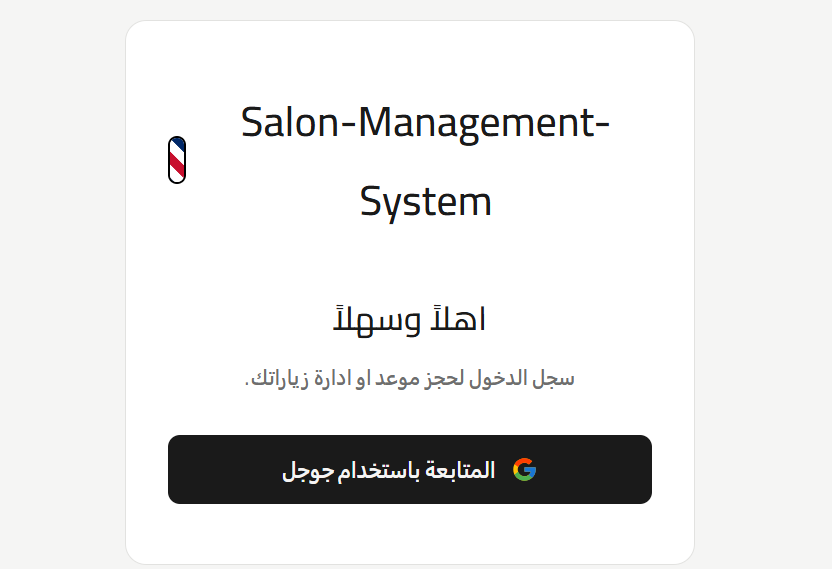
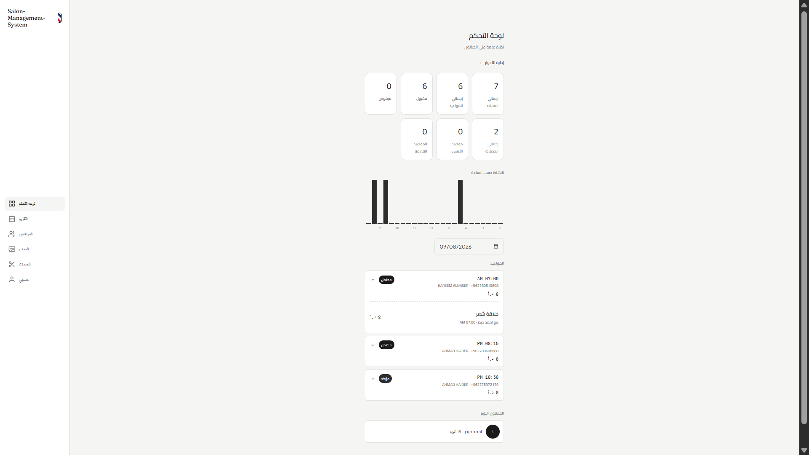
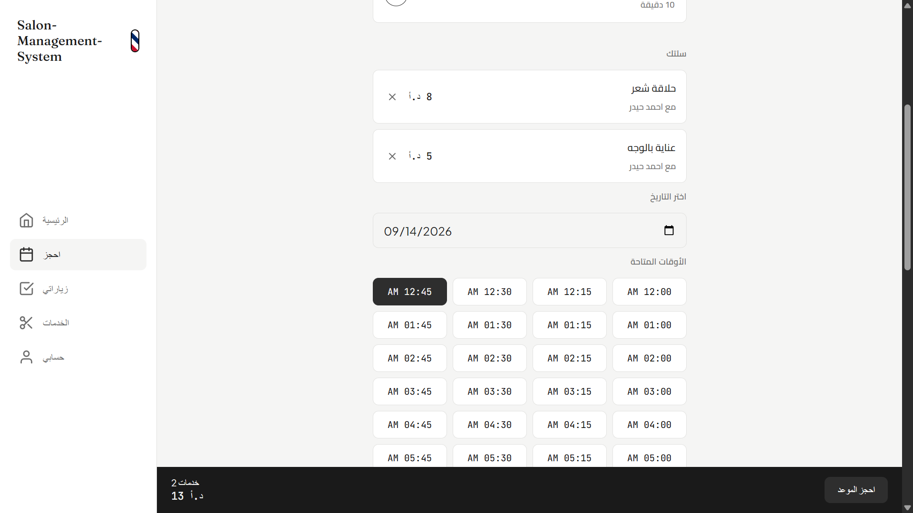
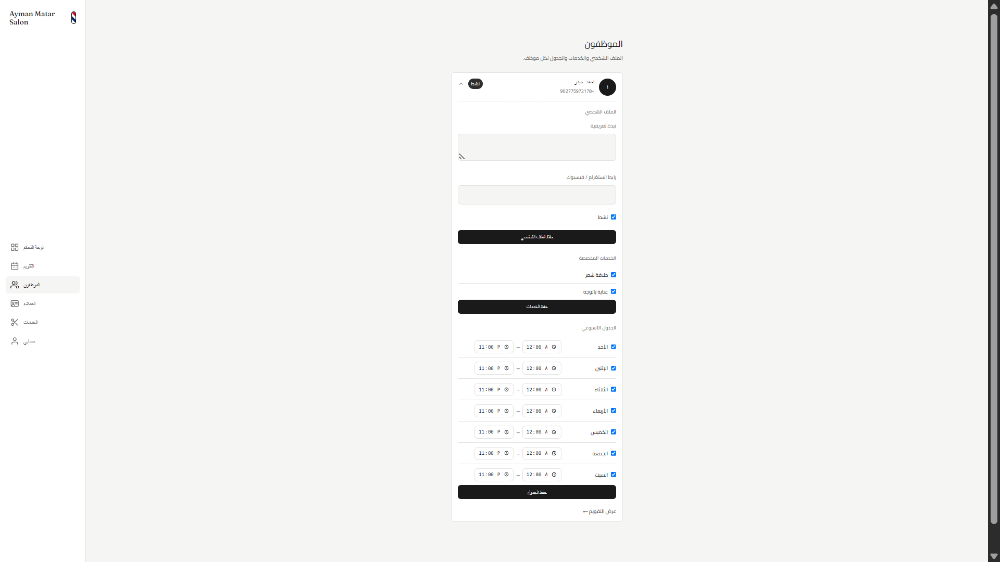
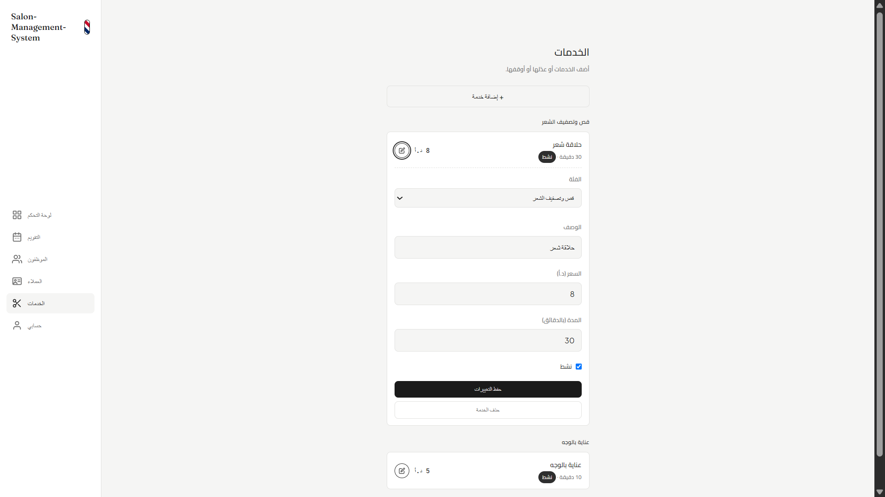
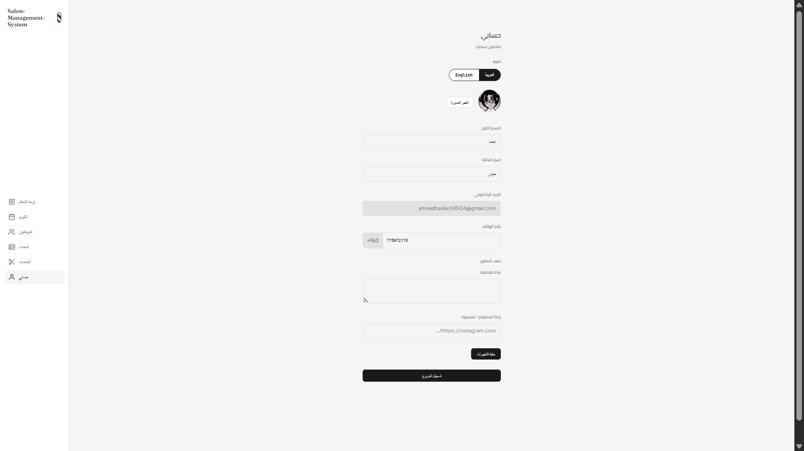

# Salon Management System

A full-stack, bilingual (Arabic/English) booking and management platform built for salons of any type — men's, women's, or unisex. Supports four distinct user roles with a real booking flow, staff scheduling, and an admin dashboard.

## Screenshots

  
  
  
  
  
  

## Features

**Client-facing**
- Google OAuth sign-in with phone number verification
- Browse services by category and book appointments with a chosen staff member
- Real-time availability checking based on staff schedules and existing bookings
- View upcoming and past appointments, with full service/pricing breakdown
- Browse staff profiles (bio, photo, social links, assigned services)
- Full bilingual UI (Arabic/English) with RTL layout support and a language switcher

**Staff (Employee)**
- Personal calendar (day/month view) showing only their own appointments
- Update own profile, bio, social links, and profile photo

**Reception**
- Salon-wide calendar across all staff, with day/month views
- Walk-in appointment booking
- Change appointment status (pending/confirmed/completed/cancelled/no-show)
- Reschedule appointments and adjust per-service pricing
- Manage employee profiles, assigned services, and weekly schedules
- View client list and each client's appointment history
- Add, edit, and deactivate services

**Admin**
- Everything Reception can do, plus:
- Dashboard with salon-wide stats, hourly activity chart, and daily appointment breakdown
- Promote/demote users between client, employee, receptionist, and admin roles

**System**
- Automated email notifications (booking confirmation, completion, upcoming-appointment reminders for staff) via the Brevo API
- Employee photo uploads via Cloudinary, with server-side validation (content-type, size limit, and real image verification — not just trusting the file extension)
- Background scheduler for reminder checks
- Role-based access control enforced at the API level, not just hidden in the UI

## Tech Stack

- **Backend:** Python, FastAPI, SQLAlchemy
- **Database:** SQLite
- **Frontend:** Jinja2 templates, vanilla JavaScript, hand-written CSS
- **Auth:** Google OAuth2 (Authlib)
- **Email:** Brevo (transactional email API)
- **Image hosting:** Cloudinary
- **Scheduling:** APScheduler

## Project Structure

```
app/
├── CRUD/            # Database operations, one file per model
├── business/        # Business logic — validation, orchestration, side effects
├── routes/          # FastAPI route definitions
├── schemas/         # Pydantic request/response schemas
├── models/          # SQLAlchemy models
├── exceptions/       # Custom exception classes per domain
├── enums/           # Shared enums (roles, appointment status, etc.)
├── services/        # Third-party integrations (email, Cloudinary, phone validation)
├── auth/            # Google OAuth client setup
├── i18n/            # Translation strings (Arabic/English)
├── frontend/
│   ├── templates/   # Jinja2 HTML templates
│   ├── static/      # CSS, images
│   └── role_routing.py  # Nav links and home routes per role
├── database.py
├── dependencies.py  # Shared FastAPI dependencies (auth, DB session)
├── config.py        # Environment variable loading
└── main.py          # App entrypoint, middleware, router registration
main.py              # Local dev launcher
requirements.txt
```

## Running Locally

**1. Clone and enter the project:**
```bash
git clone https://github.com/AhmadHaider-stu/Salon-Management-System
cd Salon-Management-System
```

**2. Create and activate a virtual environment:**
```bash
python -m venv .venv
source .venv/Scripts/activate    # Windows (Git Bash)
# or: source .venv/bin/activate  # macOS/Linux
```

**3. Install dependencies:**
```bash
pip install -r requirements.txt
```

**4. Set up environment variables** — create a `.env` file in the project root:
```
SESSION_SECRET=
CLIENT_ID=
CLIENT_SECRET=
CLOUDINARY_CLOUD_NAME=
CLOUDINARY_API_KEY=
CLOUDINARY_API_SECRET=
BREVO_API_KEY=
FROM_EMAIL=
FROM_NAME=
```
- `CLIENT_ID` / `CLIENT_SECRET` — from a Google Cloud OAuth2 credential, with `http://localhost:8000/login/auth` added as an authorized redirect URI
- `CLOUDINARY_*` — from a Cloudinary account, used for employee photo uploads
- `BREVO_API_KEY` — from a Brevo account, used for transactional emails (must use their HTTPS API, not SMTP)

**5. Run the app:**
```bash
python main.py
```

The app will be available at `http://localhost:8000`.

## API Endpoints

### Auth (`/login`)
| Method | Path | Description |
|---|---|---|
| GET | `/login` | Redirect to Google OAuth |
| GET | `/login/auth` | OAuth callback |
| GET | `/login/complete-phone` | Show phone number form (new users) |
| POST | `/login/complete-phone` | Submit phone number, complete registration |
| POST | `/login/set-language` | Switch UI language |
| POST | `/logout` | Log out |

### Users (`/user`)
| Method | Path | Description |
|---|---|---|
| GET | `/user/me` | Current user's profile |
| POST | `/user/rename` | Update first/last name |
| POST | `/user/update-phone` | Update phone number |
| GET | `/user/all` | List all users *(reception/admin)* |

### Services (`/service`)
| Method | Path | Description |
|---|---|---|
| GET | `/service/all` | List all services |
| GET | `/service/{id}/employees` | Staff who can perform a service |
| POST | `/service/add_service` | Create a service *(reception/admin)* |
| PUT | `/service/{id}` | Edit a service *(reception/admin)* |
| DELETE | `/service/{id}` | Delete a service *(reception/admin)* |

### Employees (`/employee`)
| Method | Path | Description |
|---|---|---|
| GET | `/employee/all` | List all employees |
| GET | `/employee/{id}` | Employee detail |
| GET | `/employee/{id}/services` | Services an employee performs |
| GET | `/employee/{id}/schedule` | Employee's weekly schedule |
| GET | `/employee/{id}/calendar/day` | Employee's appointments for a given day |
| GET | `/employee/{id}/calendar/month` | Employee's appointments for a given month |
| PUT | `/employee/{id}` | Update employee profile *(self/reception/admin)* |
| PUT | `/employee/{id}/schedule` | Update weekly schedule *(reception/admin)* |
| PUT | `/employee/{id}/photo` | Upload profile photo |
| POST | `/employee/{id}/assign_services` | Assign services to an employee *(reception/admin)* |

### Appointments (`/appointment`)
| Method | Path | Description |
|---|---|---|
| GET | `/appointment/my` | Current client's appointments |
| GET | `/appointment/{id}` | Appointment detail |
| POST | `/appointment/book` | Book an appointment |
| POST | `/appointment/walk-in` | Book a walk-in appointment *(reception/admin)* |
| POST | `/appointment/availability` | Check available time slots |
| PUT | `/appointment/{id}/status` | Change appointment status *(reception/admin)* |
| PUT | `/appointment/{id}/reschedule` | Reschedule an appointment *(reception/admin)* |
| POST | `/appointment/{id}/services` | Add a service to an appointment *(reception/admin)* |
| PUT | `/appointment/appointment_service/{id}/price` | Adjust a service's price *(reception/admin)* |
| DELETE | `/appointment/appointment_service/{id}` | Remove a service from an appointment *(reception/admin)* |
| DELETE | `/appointment/{id}` | Delete an appointment *(reception/admin)* |

### Clients (`/client`)
| Method | Path | Description |
|---|---|---|
| GET | `/client` | List all clients *(reception/admin)* |
| GET | `/client/{id}/appointments` | A client's appointment history *(reception/admin)* |

### Calendar (`/calendar`)
| Method | Path | Description |
|---|---|---|
| GET | `/calendar/day` | Salon-wide appointments for a day *(staff)* |
| GET | `/calendar/month` | Salon-wide appointments for a month *(staff)* |

### Dashboard (`/dashboard`)
| Method | Path | Description |
|---|---|---|
| GET | `/dashboard/summary` | Salon-wide stats *(admin)* |
| GET | `/dashboard/appointments-by-hour` | Hourly activity for a given day *(admin)* |
| GET | `/dashboard/appointments` | Appointments for a given day *(admin)* |
| GET | `/dashboard/stylists` | Staff list with today's appointment count *(admin)* |

### Roles (`/role`)
| Method | Path | Description |
|---|---|---|
| POST | `/role/make_employee/{userID}` | Promote a client to employee *(admin)* |
| DELETE | `/role/delete_employee/{userID}` | Demote an employee to client *(admin)* |
| PUT | `/role/make_receptionist/{userID}` | Promote an employee to receptionist *(admin)* |
| DELETE | `/role/delete_receptionist/{userID}` | Demote a receptionist to client *(admin)* |
| PUT | `/role/make_admin/{userID}` | Promote an employee to admin *(admin)* |
| DELETE | `/role/delete_admin/{userID}` | Demote an admin to client *(admin)* |
